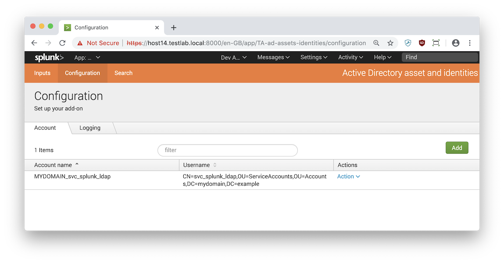
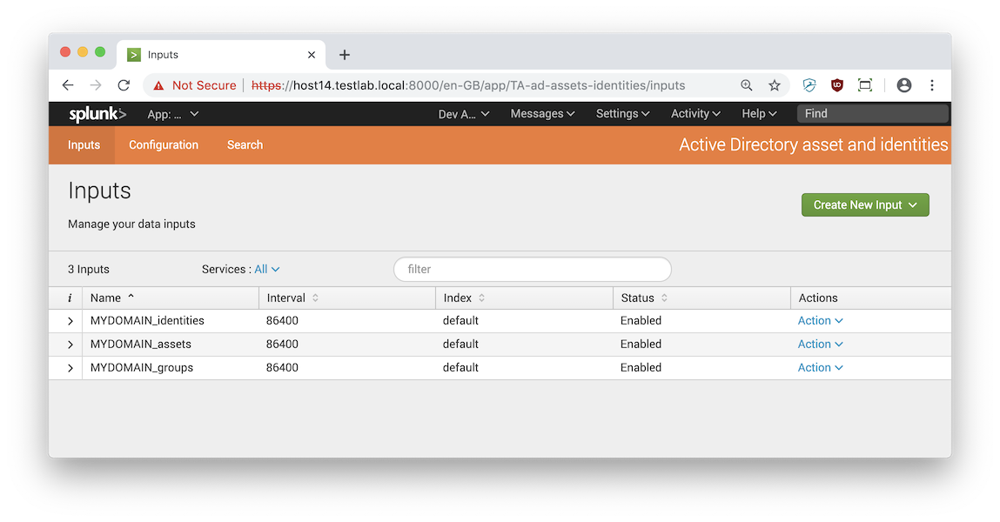

# Active Directory assets and identities technical add-on for Splunk Enterprise Security

## What does this add-on do?

This add-on dumps the following categories from Active Directory so you can use it within Splunk Enterprise Security:

1. Identities (sourcetype ad:identities)
2. Groups (sourcetype ad:groups)
3. Assets (sourcetype ad:assets)

## Why does this add-on exist

To have a fast and reliable way to dump identities, groups and assets from AD into Splunk. Dumping 100k accounts takes just 30 seconds.

## How do I use this add-on?

1. Install openldap-clients 
2. Install python-ldap
3. Install this add-on on a Splunk Enterprise instance (heavy forwarder)
4. Configure, see chapter below

## Configure



1. Add an LDAP bind account in the Configuration tab of the add-on:
   * AccountName: e.g. MYDOMAIN_svc_splunk_ldap:
   * Username: e.g. CN=svc_splunk_ldap,OU=ServiceAccounts,OU=Accounts,DC=mydomain,DC=example
   * Password: the password of the service account you use to authenticate with
2. Add a new Identities input in the Inputs tab of the add-on:
   * Name: e.g. MYDOMAIN_identities
   * Interval: e.g. 86400, for a daily interval
   * Index
   * Account: the account you just added in the Configure tab
   * Domain controller: IP or FQDN of the domain controller to query
   * Base DN: e.g: DC=mydomain, DC=example
   * LDAP attributes: predefined list of attributes to include
3. Add a new Assets input in the Inputs tab of the add-on:
   * Name: e.g. MYDOMAIN_assets
   * Interval: e.g. 86400, for a daily interval
   * Index
   * Account: the account you just added in the Configure tab
   * Domain controller: IP or FQDN of the domain controller to query
   * Base DN: e.g: DC=mydomain, DC=example
   * LDAP attributes: predefined list of attributes to include
4. Add a new Groups input in the Inputs tab of the add-on:
   * Name: e.g. MYDOMAIN_groups
   * Interval: e.g. 86400, for a daily interval
   * Index
   * Account: the account you just added in the Configure tab
   * Domain controller: IP or FQDN of the domain controller to query
   * Base DN: e.g: DC=mydomain, DC=example
   * LDAP attributes: predefined list of attributes to include



## Identities and Splunk Enterprise Security

In Enterprise Security, events that contain identities can be automatically enriched with fields detailing priority, category, first name, last name, phone number etc.

If an event contains fields like `user` or `src_user`, the event is considered to contain an identity, and an automatic lookup based on this field is performed.

Identities can appear in events as:

- Windows SID: S-1-5-21-123456789-1234567890-123456789-123456
- sAMaccoutName: someuser
- Domain + sAMaccountName: MYDOMAIN\someuser
- Kerberos user principal name: someuser@MYDOMAIN.EXAMPLE
- Email address: someuser@corpdomain.example
- Linux UID: 12345

All these fields have to be present in the `identity` multivalue field of the Splunk Enterprise Security identity lookup. Otherwise ES can't correlate these various pieces of a single identity.

## Mapping Identities

We map Active Directory LDAP attributes to Splunk ES identity attributes as follows:
 

| Splunk ES lookup field | AD ldap attribute |
|------------------------|-------------------|
| `identity`             | sAMAccountName, objectSid, userPrincipalName, "MYDOMAIN" + sAMAccountName, mail, cn, uidNumber |
| `first`                | givenName
| `last`                 | cn
| `bunit`                | department
| `phone`                | mobile
| `email`                | mail
| `work_city`            | l
| `work_country`         | c
| `managedBy`            | manager
| `category`             | TODO
| `priority`             | TODO, adminCount

### Priority and category

There are no fields in Active Directory we can use to map `category` or `priority`. The `adminCount` LDAP attribute can be used as an indicator for critical or high priority but it

To solve this issue, there are a number of possibilities:
1. Map based on OU (often there are tens to hundred different OU's)
2. Map based on group membership (often there are more security groups than accounts)
 
The most practical implementation would be to use OU, because there are only 234 OU's to map.

### Generating OU list

```
index=identities sourcetype=ad:identities
| rex field=dn "(?i)^CN=[^,]+,(?<ou>OU=.+)"
| stats count by ou
```

### LDAP attribute decoding

These LDAP attributes are decoded into human readable form:
   * userAccountControl
   * objectSid
   * pwdLastSet
   * lastLogon
   * badPasswordTime

## Generating the identity lookup

### Identity lookup

Create a new managed identity lookup in the ES identity manager, e.g. my_ad_identities.
This lookup will be used in the lookup generating search below.

### Scheduled search
You should schedule this search on the Enterprise Security search head to fill the identity lookup:

```
index=identities sourcetype=ad:identities
| rex field=dn ",(?<ou>ou=.+)"
| rex field=dn "^CN=[^,]+,(?<ou>OU=.+)"
| eval domain_plus_sAMAccountName=if(sourcetype=="ad:identities", "MYDOMAIN\\" + sAMAccountName,null())
| rename givenName AS first, sn AS last, mobile AS phone, mail AS email, l AS work_city, c AS work_country, manager AS managedBy, department AS bunit
| stats
    latest(dn) as dn,
    latest(uidNumber) as uidNumber,
    latest(cn) as cn,
    latest(domain_plus_sAMAccountName) as domain_plus_sAMAccountName,
    latest(userPrincipalName) as userPrincipalName,
    latest(objectSid) as objectSid,
    latest(first) as first,
    latest(last) as last,
    latest(bunit) as bunit,
    latest(managedBy) as managedBy,
    latest(phone) as phone,
    latest(email) as email,
    latest(work_city) as work_city,
    latest(work_country) as work_country,
    latest(ou) as ou,
    count
    by sAMAccountName
| eval identity=mvappend(email,cn,sAMAccountName,userPrincipalName,domain_plus_sAMAccountName,objectSid,uidNumber)
| eval identity=mvjoin(identity,"|")
| table identity,prefix,nick,first,last,suffix,email,phone,phone2,managedBy,priority,bunit,category,watchlist,startDate,endDate,work_city,work_country,work_lat,work_long
| outputlookup my_ad_identities
```

